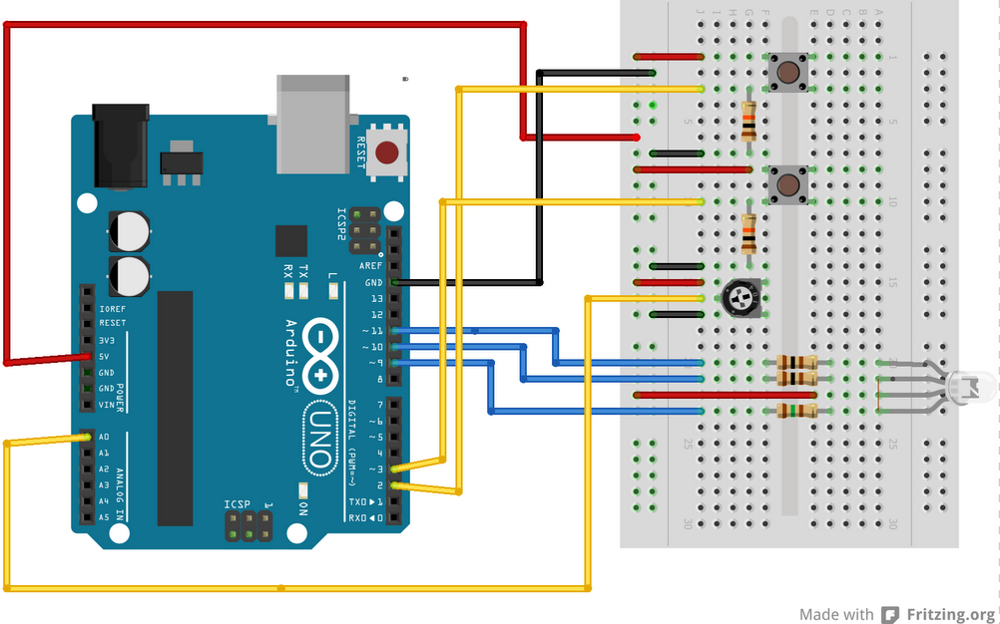
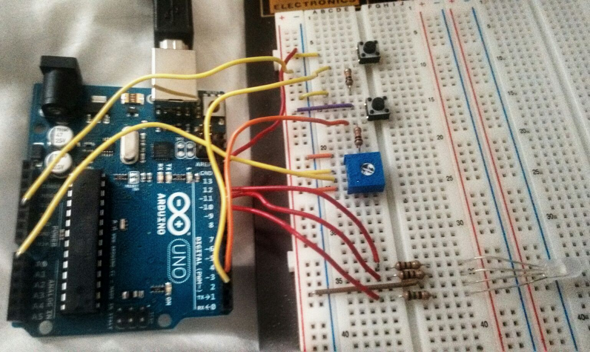

# PlayWithArduino #
This was part of my submission for MRSD Project Course.

## Materials required ##
1. Arduino Uno
2. USB A-B Cable
3. Breadboard
4. 5. Button (2)
6. RGB LED
7. 10kΩ Rotary Potentiometer
8. 150Ω Resistor
9. 100Ω Resistor (2)
10. 10kΩ Resistor (2)
11. Wire

## Circuit Set Up ##

Arduino UNO Pin | Component
--------------- | ---------
A0 | Potentiometer
2 | Button 0
3 | Button 1
9 | Red LED channel
10 | Green LED channel
11 | Blue LED channel

### Switching: ###
Switching between states happen every time Button 0 is pressed. The states shall transition in order (0, 1, 2, 0, 1, 2, …) and holding and releasing will have no further effect.

### State 0: ###
Pressing Button 1 will make LED toggle between on and off, with no further effect on holding and releasing.

### State 1: ###
When potentiometer is turned clockwise, the LED shall become brighter, and when turned anti-clockwide, the LED shall become dimmer.

### State 2: ###
The color/brightness of the LED is controlled by serial commands structured as ‘r’, ‘g’, or ‘b’, followed by a number.  The number, an integer in range [0, 255], will set brightness of that channel, with 0 for none and 255 for full brightness.

## Circuit Set Up ##

